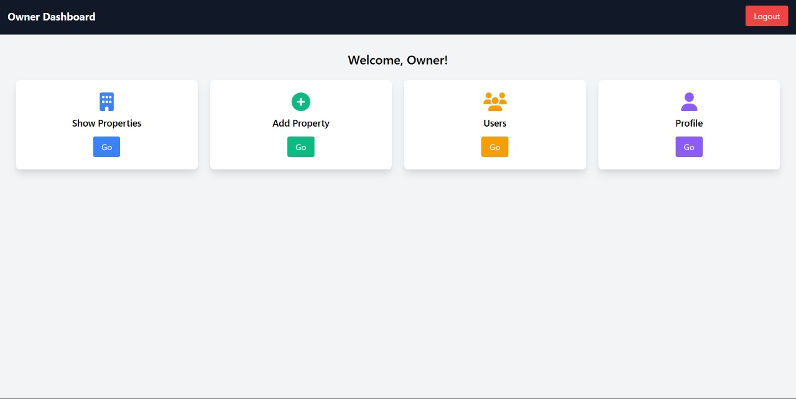
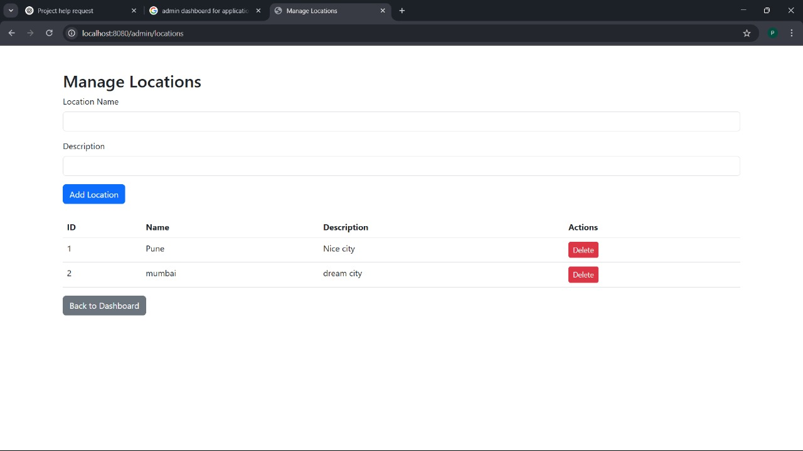

# PG Management System

## Overview
PG Management System is a web-based application developed using Spring Boot, HTML, CSS (Tailwind), and MySQL. It helps manage PG accommodations efficiently with three main modules:

- **Admin** – Full access to the system.
- **Owner** – Can add properties, rooms, and facilities.
- **Guest** – Can browse and book accommodations.

## 🛠️ Technologies Used
- **Backend:** Spring Boot  
- **Frontend:** HTML, CSS, Tailwind  
- **Database:** MySQL  

## 🔑 User Credentials
### **Admin**
- **Email:** admin123@gmail.com  
- **Password:** admin@123 

### **Owner**
- **Email:** owner@gmail.com  
- **Password:** owner  

### **Guest/User**
- **Email:** user@gmail.com  
- **Password:** user  

## 📸 Screenshots

## Screenshots

### Homepage


### Login Page


### Admin Dashboard


### Owner Dashboard


### Guest Dashboard


### Guest Profile Creation.


### Guest Registration


### Manage Locations


### Manage Owner


## 🚀 How to Run the Project
1. Clone the repository:  
   ```sh
   git clone https://github.com/your-username/pg-management.git
   cd pg-management

